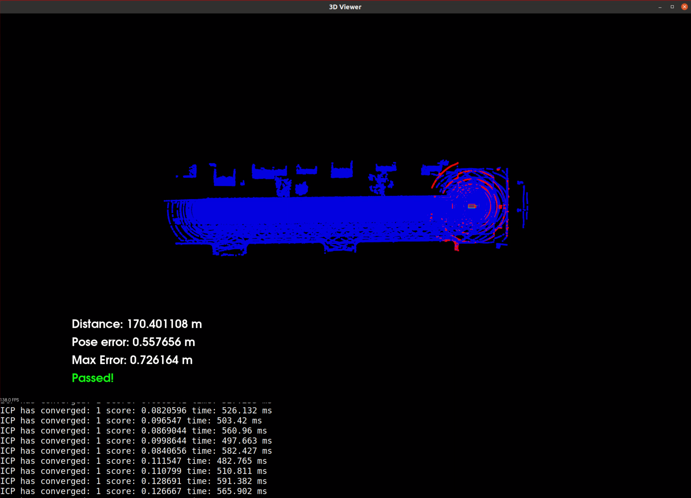

# Scan Matching Localization

Designed two scan matching algorithms, an ICP and NDT, to align point cloud scans 
from the CARLA simulator and recover the position of a self driving car with LiDAR. 
My algorithms achieved sufficient accuracy for the entirety of a drive within the 
simulated environment, updating the vehicle’s location appropriately as it moves and 
obtains new LiDAR data.


# Usage

Press the blue button "Desktop". Start one terminal. Run the Carla simulator by using these 
Unix commands:

```
su - student # Ignore Permission Denied, if you see student@ you are good
cd /home/workspace/c3-project
./run_carla.sh
```

Start another terminal. Compile the project by using these Unix commands:

```
cd /home/workspace/c3-project
cmake .
make
```

Run the project with the NDT algorithm by using Unix command:

```
./cloud_loc
```

Or run the project with the ICP algorithm by using Unix command:

```
./cloud_loc 2
```

Once the project is running, click on the map and tap the UP key 3 times, with delays of 1 second between taps. If the green car gets left behind, run the project again and tap the UP key 3 times again. The second run or the third run usually produce better results than the results of the first run. **IMPORTANT: Never stop the Carla simulator.**


# Video Demonstrations

**Scan Matching Localization with LiDAR Point Clouds - Algorithm 1: Normal Distributions Transform NDT<br/>
https://youtu.be/EOKKcwuBtzo**


**Scan Matching Localization with LiDAR Point Clouds - Algorithm 2: Iterative Closest Point (ICP)<br/>
https://www.youtube.com/watch?v=hZeZAm4jvW4**

